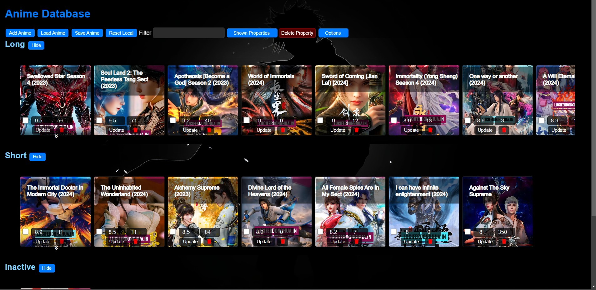

# AnimeManager
A anime manager to add and keep track of animes/donghua/other forms of it that you are watching. You can add urls where you watch them, rate them and get them on top, keep track of number of episodes you have watched and add any other info you want to keep track of.

### Steps
1. Install Python
2. Run 'pip install -r requirements.txt'
3. Run 'python ./app.py'
4. Open http://localhost:8000/ in browser
5. Click AddAnime
6. Fill details in prompts like Name, Rating, No. Episodes Watched, Watching URL.
7. You can also add URL of anime by clicking the ProLink Button if parsing on that site is supported in app.py
8. Update the animes if needed as you want.
   

### Features
1. In Filter tab
   - Type some characters and click anywhere else outside the input, the query will be searched with name.
   - If you want to search by thresholding on rating, use rating > 8, or episodesWatched > 10
2. New properties can be added like Genre, Language etc. by hovering on Show Properties button and clicking Add Property
   - New property can be of 2 types, 'number' and any-other thing. If you add it as number then it will ask for step which represents the max decimal precision of that property also minimal increment on arrows.
   - You can delete the existin property by clicking delete proeprty button.
   - To show these properties in list simply hover over shown proeprties and select respective checkboxes.
3. Update button allows you to update that particular anime item and delete button deletes it.
4. Save anime can be used to save the browser localStorage data to be stored in computer drive and Load button can be used to reload that file.
5. Reset local simply resets the browser localStorage, so make sure u save before clicking this.
6. When you update the anime rating, the list gets auto sorted to keep u interested in top animes.